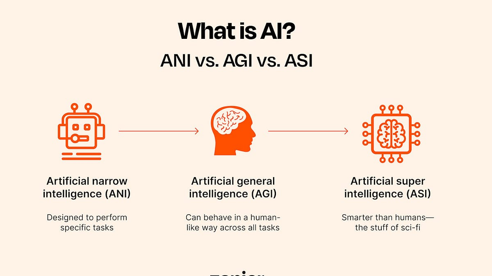

# AgenticSeek: Next-Generation AGI Research Platform

<p align="center">
  
</p>

<p align="center">
  
</p>

<p align="center">
  <strong>"Building More Advanced AI from Existing AI"</strong>
</p>

<p align="center">
  
  
  
</p>

---

*A **100% local autonomous AI platform** designed for researching and advancing toward Artificial General Intelligence. This isn't just an AI assistant—it's a **research platform** that combines advanced reasoning, persistent memory, deep research, and multi-modal capabilities to push the boundaries of what's possible with AI.*

---

## 🚀 Vision

**AgenticSeek is built on a simple idea:** Existing AI has incredible potential. By combining the latest advancements in reasoning, memory, research, and multi-modal processing, we can build AI systems that don't just respond—they **think, learn, and evolve**.

We believe in:
- 🔬 **Research-Driven Development** — Using AI to advance AI
- 🧠 **Persistent Intelligence** — AI that remembers, learns, and grows
- 🔒 **Privacy-First Architecture** — All data stays local, always
- 🌐 **Open Evolution** — Building toward AGI openly and collaboratively

---

## 🌟 Why AgenticSeek?

<p align="center">
  
</p>

| Traditional AI Assistants | AgenticSeek |
|---------------------------|-------------|
| Reactive single responses | Proactive multi-step reasoning |
| No persistent memory | Long-term learning across sessions |
| Single modality | Vision, audio, text, video |
| Closed systems | Extensible AGI architecture |
| Static capabilities | Self-evolving intelligence |
| Cloud-dependent | 100% local operation |

---

## 🧠 Advanced Capabilities (2026)

<p align="center">
  
</p>

### 1. Advanced Reasoning Engine
```
sources/reasoning/advanced_reasoning.py
```
- **Chain-of-Thought (CoT)** — Step-by-step logical reasoning
- **Self-Reflection** — Automatic error detection and correction
- **Tree of Thoughts** — Exploring multiple solution paths
- **ReAct** — Reasoning + Acting for complex tasks
- **Plan-and-Execute** — Multi-step workflow orchestration

### 2. Long-Term Memory System
```
sources/memory/long_term_memory.py
```
- **Episodic Memory** — Learns from experiences and interactions
- **Semantic Memory** — Builds persistent knowledge bases
- **Procedural Memory** — Retains skills and procedures
- **Working Memory** — Manages current context intelligently
- **Memory Consolidation** — Importance-based retention with decay

### 3. Deep Research Agent
```
sources/research/deep_research.py
```
- **Autonomous Investigation** — Multi-source exploration
- **Evidence Verification** — Cross-referencing and validation
- **Contradiction Detection** — Identifying conflicting information
- **Gap Analysis** — Finding knowledge gaps automatically
- **Structured Reports** — Generating comprehensive research documents

### 4. Multi-Modal Processing
```
sources/multimodal/multi_modal.py
```
- **Vision** — Image understanding, OCR, chart analysis, UI parsing
- **Audio** — Speech recognition, translation, sentiment analysis
- **Documents** — PDF extraction, DOCX processing, structured data
- **Video** — Scene detection, key frame extraction, summarization

### 5. Model Context Protocol (MCP)
```
sources/mcp/mcp_server.py
```
- **Industry-Standard Integration** — Seamless tool connectivity
- **Extensible Architecture** — Add your own tools and capabilities
- **Resource Management** — External data source integration
- **Scalable Design** — Support for multiple concurrent connections

### 6. Virtual Sandbox
```
sources/sandbox/virtual_sandbox.py
```
- **Secure Code Execution** — Python, JavaScript, Bash
- **Resource Limits** — CPU, memory, time constraints
- **Network Isolation** — Security by default
- **Multi-Language Support** — Run code in various languages safely

### 7. AGI Integration Layer
```
sources/agi/agi_integration.py
```
- **Unified Control** — Single interface for all capabilities
- **Session Management** — Persistent context across interactions
- **Capability Orchestration** — Coordinated multi-system operation
- **Research-Ready** — Built for AGI experimentation

---

## 📊 Project Status

| Component | Status | Description |
|-----------|--------|-------------|
| Core Browser Agent | ✅ Stable | Autonomous web browsing |
| LLM Router | ✅ Stable | Smart model selection |
| Speech/Text | ✅ Stable | Voice interaction |
| Advanced Reasoning | ✅ **NEW** | Chain-of-thought reasoning |
| Memory System | ✅ **NEW** | Persistent learning |
| Research Agent | ✅ **NEW** | Deep investigation |
| Multi-Modal | ✅ **NEW** | Cross-modal understanding |
| MCP Protocol | ✅ **NEW** | Tool integration |
| Sandbox | ✅ **NEW** | Secure execution |

---

## 🛠️ Quick Start

### Prerequisites
- Python 3.10+
- Docker & Docker Compose
- Local LLM (Ollama/LM Studio) OR API keys

### Installation

```bash
# Clone the repository
git clone https://github.com/jeevesh415/agenticSeek.git
cd agenticSeek

# Setup environment
cp .env.example .env

# Edit .env with your configuration
nano .env

# Start services
./start_services.sh full

# Access the interface
open http://localhost:3000
```

### Configuration

Edit `config.ini`:

```ini
[MAIN]
is_local = true
provider_name = ollama
provider_model = deepseek-r1:14b
agent_name = Jarvis
recover_last_session = true
save_session = true
speak = false
listen = false

[BROWSER]
headless_browser = true
stealth_mode = true
```

---

## 💡 Usage Examples

### Advanced Reasoning
```python
from sources.agi.agi_integration import AGIFactory

agent = AGIFactory.create_full(llm_client, web_search, web_fetch)
await agent.start_session()

result = await agent.think(
    "Design a system that achieves AGI",
    use_reasoning=True
)
print(result.conclusion)
```

### Research Agent
```python
report = await agent.research(
    topic="Latest developments in AGI 2026",
    depth="deep"
)
print(report.executive_summary)
print(f"Found {len(report.sources)} sources")
```

### Memory System
```python
# Remember important information
await agent.remember(
    content="User prefers concise, technical responses",
    memory_type="episodic",
    tags=["preference", "communication"]
)

# Recall relevant context
memories = await agent.recall("user preferences")
context = await agent.get_context()
```

---

## 🔬 Research Focus

AgenticSeek serves as a **research platform** for studying:

1. **Reasoning** — How can AI think more effectively?
   - Chain-of-thought, self-reflection, tree search
   
2. **Memory** — How can AI learn and retain knowledge?
   - Episodic, semantic, procedural memory
   
3. **Autonomy** — How can AI operate independently?
   - Self-directed research, self-debugging code
   
4. **Safety** — How can we ensure beneficial outcomes?
   - Sandboxed execution, transparent reasoning
   
5. **Privacy** — How can we maintain human control?
   - 100% local operation, no data transmission

---

## 📁 Project Structure

```
agenticSeek/
├── sources/
│   ├── reasoning/          # Advanced reasoning engine
│   ├── memory/             # Long-term memory system
│   ├── research/           # Deep research agent
│   ├── multimodal/         # Multi-modal processing
│   ├── mcp/                # Model Context Protocol
│   ├── sandbox/            # Virtual sandbox
│   ├── agi/                # AGI integration layer
│   ├── agents/             # Core agents
│   ├── browser.py          # Browser automation
│   ├── router.py           # LLM routing
│   └── ...
├── ADVANCED_CAPABILITIES.md
├── README.md
└── ...
```

---

## 🎨 Futuristic Gallery

<p align="center">
  
  
</p>

<p align="center">
  
  
</p>

---

## 🤝 Contributing

We welcome contributions:

- 🔬 **Research** — New reasoning strategies, memory architectures
- 🛠️ **Code** — Performance improvements, bug fixes
- 📖 **Documentation** — Tutorials, research papers
- 🧪 **Testing** — Benchmarking, evaluation frameworks

---

## 📜 License

**GPL-3.0** — Open source with commercial use permitted.

---

## 🙏 Acknowledgments

- Original concept by Fosowl
- Advanced capabilities integration by MiniMax Agent
- Contributions from the open-source community
- Built upon latest 2026 AGI research

---

## 🔗 Links

- 🌐 **Website**: http://agenticseek.tech
- 🐦 **Twitter**: @Martin993886460
- 💬 **Discord**: Join our community
- 📚 **Documentation**: See ADVANCED_CAPABILITIES.md

---

<p align="center">
  <strong>Building More Advanced AI from Existing AI</strong><br>
  Join us in pushing the boundaries of artificial intelligence.
</p>

<p align="center">
  
  
</p>
